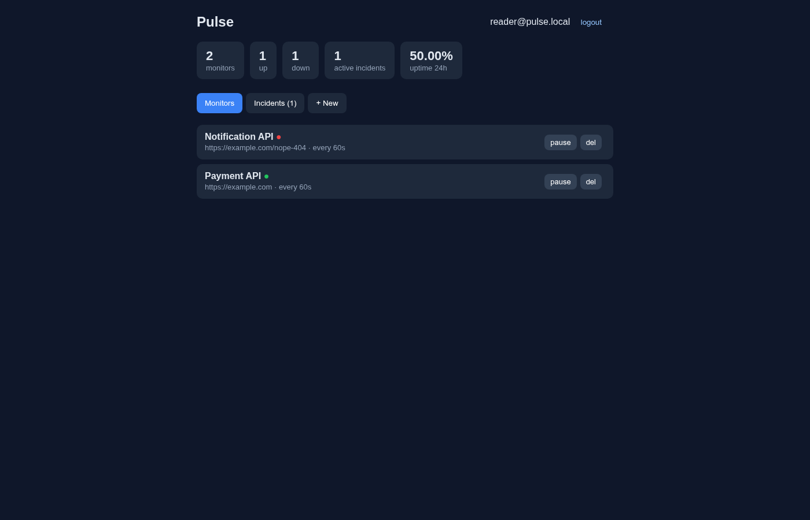
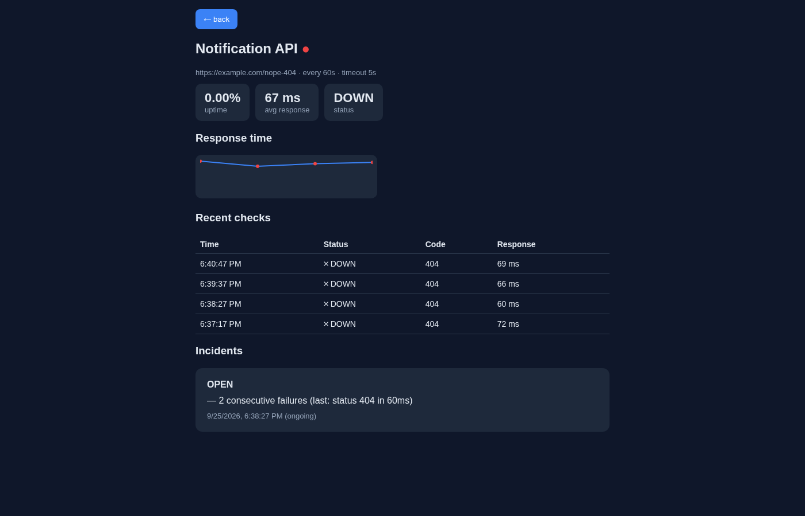

# Pulse Web — monitoring dashboard

> Ecosystem: [api](https://github.com/RakhaYandra/pulse) · [web](https://github.com/RakhaYandra/pulse-web) (this repo)

React dashboard for the Pulse monitoring API: overview stats, monitor
list/detail with SVG response-time chart, recent checks, incident history,
monitor CRUD + pause/resume. No router — state-driven views; data refreshes
every 15s. Full Clean Architecture (see below).





## Dev

Requirements: Node 18+.

```bash
npm install
npm run dev   # http://localhost:5173 (API default http://localhost:8080)
```

Point at another API:

```bash
VITE_API_URL=http://host:8080 npm run dev
```

## Prod

```bash
VITE_API_URL=http://api-host:8080 docker compose up -d --build  # :5173
```

The image builds the static bundle with the API URL baked in (Vite),
then serves it via nginx.

## Test

```bash
npx vitest run          # 15 unit tests (domain + use-cases, fake gateways)
npm test --prefix e2e   # 5 Playwright tests, black-box (needs API + web up)
BASE_URL=http://other:5173 npm test --prefix e2e   # against another frontend
```

E2E registers throwaway users and drives the real UI; the API contract it
relies on is owned by the backend repo (`qa/collection.json`, Newman 20/20).

## Architecture

Full Clean Architecture ([ADR-001](docs/ADR-001-fe-ca.md)):

```
domain/          entities + pure stats (uptimePct, avgResponseMs,
                 sparkPoints, countOpen) — zero React/fetch
application/     ports (gateway shapes) + use-cases (auth, dashboard,
                 monitors, detail) — constructor-injected, fake-tested
infrastructure/  httpClient (transport), apiGateway (endpoint + JSON→domain
                 mapping), tokenStore (localStorage adapter)
presentation/    pure components + hooks (polling + state)
App.jsx          composition root — the only place layers are wired
```

Layer rules (grep-verified): `domain/` has no React/fetch/localStorage;
`application/` has none either; views never import infrastructure (only via
hooks/props).

Auth: JWT from login/register, stored via `TokenStore`, sent as
`Authorization: Bearer`; 401 on restore clears the session back to login.

## Layout

```
src/
├── domain/           entities.js, stats.js (+ tests)
├── application/      useCases.js (+ fake-gateway tests)
├── infrastructure/   httpClient.js, apiGateway.js, tokenStore.js
├── presentation/
│   ├── components/   LoginForm, DashboardScreen, MonitorDetailScreen,
│   │                 MonitorList, MonitorForm, Spark, Stats, Dot, Lists
│   └── hooks/        useAuth, useDashboard, useMonitorDetail, usePolling
├── App.jsx           composition root
└── main.jsx + index.css
e2e/                   Playwright suite (package.json, config, tests/)
```

Backend + engine: [RakhaYandra/pulse](https://github.com/RakhaYandra/pulse).
